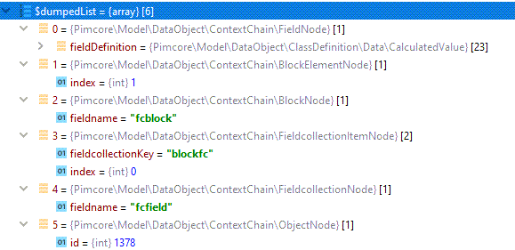

# Calculated Value Datatype


## General

The calculated-value datatype allows you to calculate attributes based on the value of various other attributes. 
The only data stored is the one in the object's query tables.

Let's have a closer look by walking through a simple example.

Let's suppose we have a very simple class with 2 number fields called xValue and yValue and a calculated-value field 
called `sum` placed inside a localizedfields container.


The first step is to provide a PHP calculator class implementing the `CalculatorClassInterface` interface. The `compute` method needs to be implemented which computes the result for the `sum` field. An example is shown below.

The arguments passed into this method is the Pimcore object and the contextual information telling you which 
calculated-value field is affected and where it is located at.

The extent of information depends on the datatype of the owner of the calculated-value field 
(localizedfield, object brick etc.). The details are documented below.

```php
namespace Website;
 
use Pimcore\Model\DataObject\Concrete;
use Pimcore\Model\DataObject\ClassDefinition\CalculatorClassInterface;
use Pimcore\Model\DataObject\Data\CalculatedValue;
 
class CalculatorDemo implements CalculatorClassInterface
{
    public function compute(Concrete $object, CalculatedValue $context):string {
        if ($context->getFieldname() == "sum") {
            $language = $context->getPosition();
            return $object->getXValue($language) +  $object->getYValue($language);
        } else {
            \Logger::error("unknown field");
        }
    }

    public function getCalculatedValueForEditMode(Concrete $object, CalculatedValue $context): string
    {
        return $this->getCalculatedValueForEditMode($object, $context);
    }
} 
```

As we see here, the calculator class sums up the x and y values from the corresponding language tab.

In addition to the `compute` method you need to implement the `getCalculatedValueForEditMode` method. This method is used to display the value in object edit mode:
```php
public function getCalculatedValueForEditMode(Concrete $object, CalculatedValue $context): string {
    $language = $context->getPosition();
    $result = $object->getXValue($language) . " + " . $object->getYValue($language) . " = " . $this->compute($object, $context);
    return $result;
}
```

The visual outcome would be as follows: 


You can also provide a Symfony service as calculator class via `@` prefix (e.g. `@service_name`).


## Working with PHP API

Getter methods on the object class are generated as usual. The code to retrieve the values would then be: 
```php
$object = Object_Abstract::getByPath("/demoobject");
$valueDe =  $object->getSum("de");   // => 38
$valueEn =  $object->getSum("en");   // => 11
```

## Context Information for Calculation Class
As said before, the richness of the context information depends on the location of the calculated-value field.

### Context Information (old deprecated style - since 6.7.0 Lambic)

> Do not use this anymore. Use the context chain described below.

#### Object (top-level)

| Name      | Description                                        |
|-----------|----------------------------------------------------|
| ownerType | `"object"`                                         |
| fieldName | the name of the calcuated-value field (e.g. `sum`) |


#### Localizedfields

| Name      | Description                                         |
|-----------|-----------------------------------------------------|
| position  | the language ("en", "de", ...)                      |
| ownerType | `"localizedfield"`                                  |
| ownerName | the name of the localized field ("localizedfields") |


#### Objectbricks

| Name          | Description                                                     |
|---------------|-----------------------------------------------------------------|
| ownerType     | `"objectbrick"`                                                 |
| ownerName     | the name of the objectbrick field inside the object             |
| fieldName     | the name of the attribute inside the brick                      |
| index         | the name of the brick                                           |
| keyDefinition | the calculated-value field definition                           |
| position      | the language ("en", "de", ...) if calculated field is localized |


#### Fieldcollections

| Name          | Description                                          |
|---------------|------------------------------------------------------|
| ownerType     | `"fieldcollection"`                                  |
| ownerName     | the name of the fieldcollection attribute            |
| fieldName     | the name of the attribute inside the fieldcollection |
| index         | the index of the fieldcollection item                |
| keyDefinition | the calculated-value field definition                |


#### Classification Store

| Name          | Description                                              |
|---------------|----------------------------------------------------------|
| ownerType     | `"classificationstore"`                                  |
| ownerName     | the name of the fieldcollection attribute                |
| fieldName     | the name of the attribute inside the fieldcollection     |
| position      | the language                                             |
| groupId       | group id                                                 |
| keyId         | key id                                                   |
| keyDefinition | the fielddefinition of the classificationstore attribute |

#### Block

> Not supported with old style. Use new style instead.

### Context Information (new style  - since 6.7.0 Lambic)

The owner chain is a doubly linked list describing every container starting from field level up to the
object owning the data.

#### Usage


```php
$chain = $context->getOwnerChain();

// returns the field node
/** @var FieldNode $fieldNode */
$fieldNode = $chain->getBottom();

// returns the field node and gets the direct container
$chain->rewind();               // reset iterator to start (i.e. the field node)
$chain->next();                 // move pointer
$container = $chain->current(); // get the container (for example LocalizedfieldNode) 
```

This dumped owner chain should give you an idea for a calculated value inside a block inside a fieldcollection.



#### Chain Nodes

Possible Node Types (namespace `Pimcore\Model\DataObject\ContextChain`)

| Name                         | Description                     |
|------------------------------|---------------------------------|
| FieldNode                    | The data attribute              |
| LocalizedsfieldNode          | Localized fields container      |
| ObjectNode                   | the object                      |
| ObjectbrickNode              | Objectbrick container           |
| FieldcollectionNode          | Field collection container      |
| FieldcollectionItemNode      | Field collection item container |
| BlockElementNode             | Block element on field level    |
| BlockNode                    | Block container                 |
| ClassificationstoreFieldNode | Classification store data node  |
| ClassificationstoreNode      | Classification store container  |

